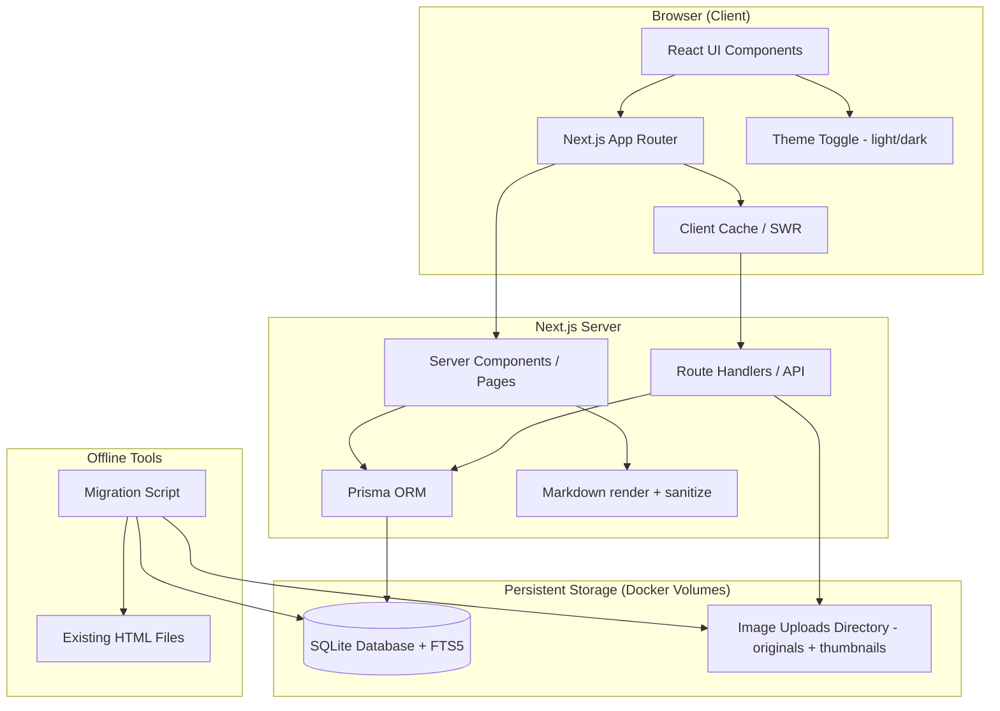
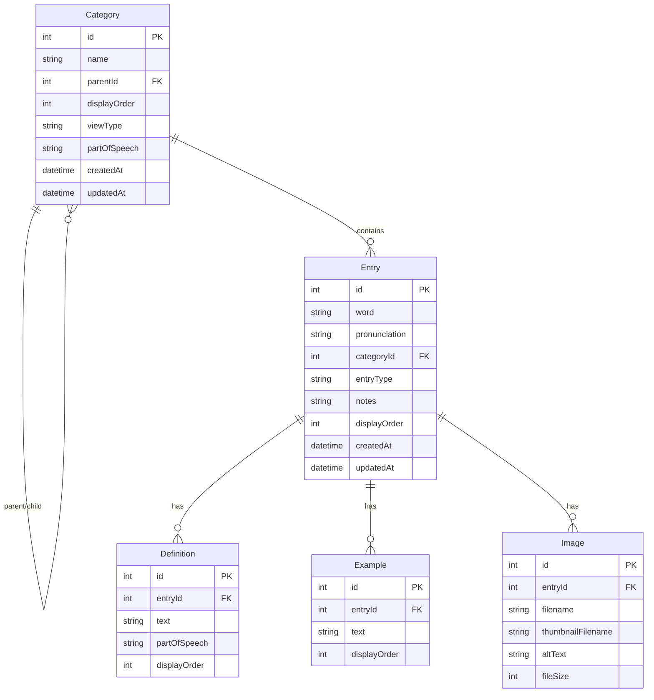
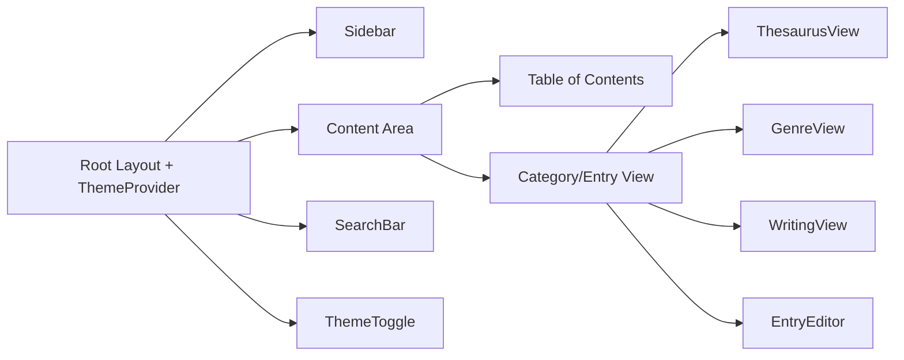
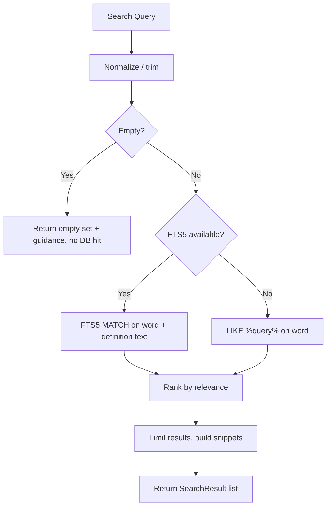
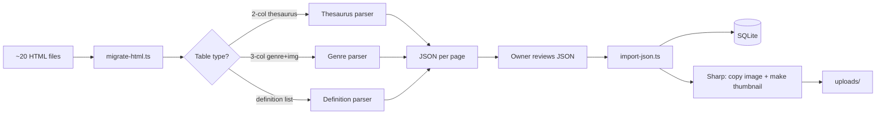
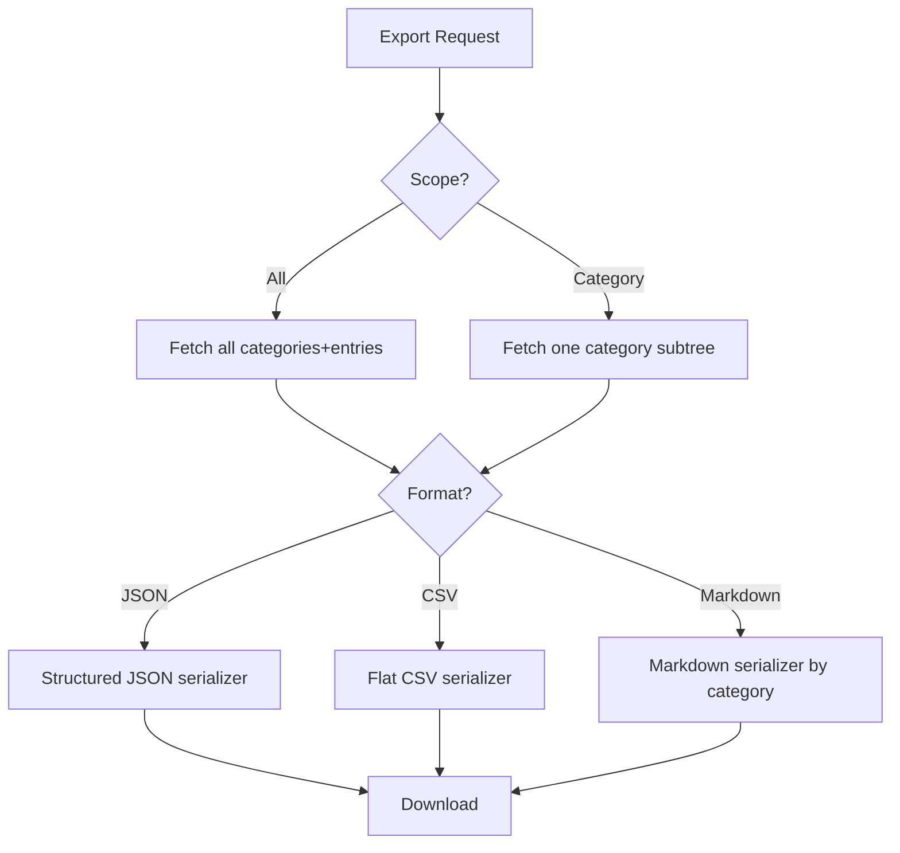
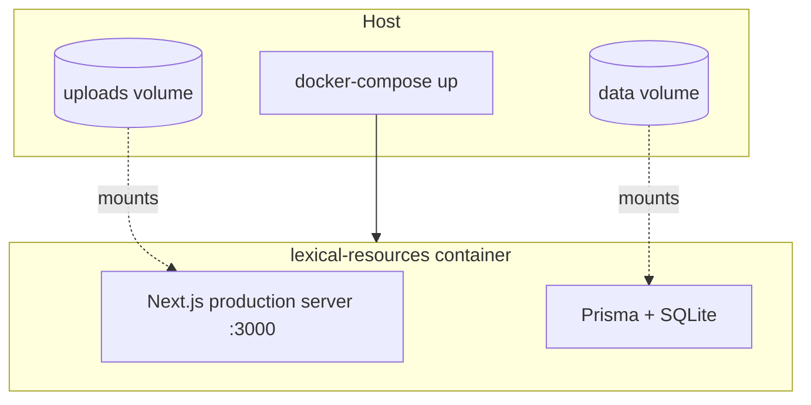

# Design — Lexical Resources System

## Overview

The Lexical Resources System is a single-user web application for managing a bilingual (English-Chinese) lexical collection. It replaces the existing static HTML/CSS/JS site with a modern, database-backed Next.js application featuring dynamic category management, full CRUD operations, search, image support, multi-format export, and Docker deployment.

This design maps each requirement to concrete architecture, data models, components, and APIs. It targets a fast local experience (< 500ms page loads, < 200ms search) for collections up to 10,000 entries.

### Design Goals

- **Single-user simplicity**: No authentication, no multi-tenancy. The owner has full control.
- **Data preservation**: Faithfully migrate the existing ~20 pages of richly structured content.
- **Flexible organization**: Fully dynamic category hierarchy supporting nesting, reordering, and renaming.
- **Content fidelity**: Preserve thesaurus groupings, genre-with-image layouts, and writing/speaking structures, including inline formatting (line breaks, bold, numbered senses).
- **Portability**: Run anywhere via a single Docker container with persistent volumes.

### Key Design Decisions (from the design plan)

These decisions were confirmed during the design Q&A and drive the architecture below:

| # | Decision | Choice |
|---|----------|--------|
| Q1 | ORM | **Prisma** |
| Q2 | Styling | **Tailwind CSS** |
| Q3 | Data fetching / state | **Server Components + SWR** |
| Q4 | Rendering strategy | **SSR-first with client routing** |
| Q5 | Definitions/examples storage | **Fully normalized tables** |
| Q6 + Q13 | Bilingual text | **Single mixed-language `text` field, stored as Markdown** |
| Q9 | Search | **SQLite FTS5** (LIKE fallback) |
| Q10 | Migration | **Extract to JSON → review → import** |
| Q11 | Testing | **Vitest + fast-check + Playwright** |
| Q12 | Thesaurus modeling | **Reuse the Category tree** (`viewType="thesaurus"`; semantic labels are nested categories) |
| Q14 | Theme | **Light + dark toggle; default dark, dark preserves the original identity** |
| Q15 | Images | **Generate thumbnails on upload with Sharp** |
| Q16 | Access control | **No app-level auth; localhost/trusted-network only** |
| Q17 | Large views | **Render all + virtualized scrolling** |
| Q18 | Category deletion | **Prompt each time: reassign entries or cascade-delete** |

### Requirements Mapping Summary

| Requirement | Primary Design Section |
|-------------|------------------------|
| R1 Dynamic Categories | Data Model (Category), Category API, Sidebar Component |
| R2 Entry CRUD | Data Model (Entry), Entry API, Entry Editor Component |
| R3 Bilingual Content | Data Model (mixed-language Markdown text fields), Rendering |
| R4 Image Upload | Image Storage, Upload API, Image Component |
| R5 Responsive Sidebar | Layout Components, Responsive Strategy |
| R6 Basic Search | Search API, SQLite FTS5 indexing |
| R7 Migration | Migration Pipeline |
| R8 Export | Export API, Format Serializers |
| R9 Thesaurus Groups | Data Model (Category as group), Thesaurus View |
| R10 Genre + Images | Data Model (entry layout + Image), Genre Grid View |
| R11 Performance | Caching, Indexing, Virtualization, Client Routing |
| R12 Docker | Deployment, Dockerfile, Compose |
| R13 Writing Phrases | Data Model (entry types), Writing Views |
| R14 Speaking Content | Data Model (entry types), Speaking Views |

## Architecture

### High-Level Architecture



### Technology Stack

| Layer | Choice | Rationale |
|-------|--------|-----------|
| Framework | Next.js 14+ (App Router) | SSR for fast loads, file-based routing, API routes co-located |
| Language | TypeScript | Type safety across data models and API contracts |
| Database | SQLite | Single-file, no server, ideal for single-user local/Docker use |
| ORM | Prisma | Type-safe queries, migrations, good SQLite support |
| Styling | Tailwind CSS | Rapid responsive UI, small bundle, utility-first |
| Theme | `next-themes` + Tailwind `dark:` variants | Light/dark toggle, default dark, persisted preference |
| Data fetching | SWR | Client-side caching for fast category navigation |
| Search | SQLite FTS5 + LIKE fallback | Fast full-text indexing without external service |
| Rich text | Markdown stored; `react-markdown` + `rehype-sanitize` to render | Preserves bold/line breaks/lists from source; XSS-safe (NFR4) |
| Virtualization | `@tanstack/react-virtual` (or `react-window`) | Render large categories (80+ groups, 100s of entries) smoothly |
| Image handling | Sharp (validation + thumbnails) + local FS | Generates thumbnails on upload, local storage, no cloud dependency |
| Migration | Node.js + `node-html-parser` | Parse existing HTML tables to JSON |
| Testing | Vitest + fast-check (PBT) + Playwright (E2E) | Fast unit/integration, property tests, end-to-end flows |
| Container | Docker + docker-compose | Portable deployment with persistent volumes |

### Project Structure

```
lexical-resources-system/
├── prisma/
│   ├── schema.prisma          # Data models
│   └── migrations/            # DB migration history
├── src/
│   ├── app/                   # Next.js App Router
│   │   ├── layout.tsx         # Root layout (theme provider + sidebar + content)
│   │   ├── page.tsx           # Home / overview
│   │   ├── category/[id]/     # Category content view
│   │   ├── entry/[id]/        # Single entry view/edit
│   │   ├── search/            # Search results page
│   │   └── api/               # Route handlers
│   │       ├── categories/
│   │       ├── entries/
│   │       ├── images/
│   │       ├── search/
│   │       └── export/
│   ├── components/
│   │   ├── Sidebar.tsx
│   │   ├── TableOfContents.tsx
│   │   ├── ThemeToggle.tsx
│   │   ├── Markdown.tsx        # Sanitizing Markdown renderer
│   │   ├── VirtualList.tsx     # Virtualized list wrapper
│   │   ├── EntryEditor.tsx
│   │   ├── EntryView.tsx
│   │   ├── ThesaurusView.tsx
│   │   ├── GenreGridView.tsx
│   │   └── SearchBar.tsx
│   ├── lib/
│   │   ├── db.ts              # Prisma client singleton
│   │   ├── search.ts          # Search logic (FTS5 + fallback)
│   │   ├── markdown.ts        # Markdown sanitize/render helpers
│   │   ├── images.ts          # Upload validation + Sharp thumbnails
│   │   ├── export/            # JSON/CSV/Markdown serializers
│   │   └── validation.ts      # Input validation/sanitization
│   └── types/                 # Shared TypeScript types
├── scripts/
│   ├── migrate-html.ts        # HTML → JSON extraction
│   └── import-json.ts         # JSON → SQLite import
├── data/                      # SQLite file (volume-mounted)
├── uploads/                   # Image files: originals + thumbnails (volume-mounted)
├── Dockerfile
├── docker-compose.yml
└── package.json
```

## Data Models

### Entity Relationship Diagram



> **Note on the thesaurus model (Q12=A):** There is no separate `ThesaurusGroup` table. A thesaurus group is simply a `Category` with `viewType = "thesaurus"`, and semantic labels (e.g. "刺激。激发") are nested categories under a part-of-speech category (V/N/ADJ/Collection). An entry's membership in a group is just its `categoryId`. This keeps a single unified hierarchy (R1) and satisfies R9 without a parallel entity.

### Prisma Schema (conceptual)

```prisma
model Category {
  id           Int        @id @default(autoincrement())
  name         String
  parentId     Int?
  parent       Category?  @relation("CategoryTree", fields: [parentId], references: [id])
  children     Category[] @relation("CategoryTree")
  displayOrder Int        @default(0)
  viewType     String     @default("list")  // "list" | "thesaurus" | "genre" | "writing" | "speaking"
  partOfSpeech String?    // for thesaurus categories: "V" | "N" | "ADJ" | "Collection"
  entries      Entry[]
  createdAt    DateTime   @default(now())
  updatedAt    DateTime   @updatedAt

  @@index([parentId])
  @@index([displayOrder])
}

model Entry {
  id            Int       @id @default(autoincrement())
  word          String
  pronunciation String?
  categoryId    Int
  category      Category  @relation(fields: [categoryId], references: [id])
  entryType     String    @default("word")  // "word" | "phrase" | "structure" | "expression" | "speaking"
  notes         String?   // Markdown
  definitions   Definition[]
  examples      Example[]
  images        Image[]
  displayOrder  Int       @default(0)
  createdAt     DateTime  @default(now())
  updatedAt     DateTime  @updatedAt

  @@index([categoryId])
  @@index([word])
  @@unique([word, categoryId])   // NFR3: prevent duplicates within a category
}

model Definition {
  id            Int     @id @default(autoincrement())
  entryId       Int
  entry         Entry   @relation(fields: [entryId], references: [id], onDelete: Cascade)
  text          String  // mixed English/Chinese, stored as Markdown (Q6+Q13)
  partOfSpeech  String?
  displayOrder  Int     @default(0)
}

model Example {
  id           Int    @id @default(autoincrement())
  entryId      Int
  entry        Entry  @relation(fields: [entryId], references: [id], onDelete: Cascade)
  text         String // mixed English/Chinese, stored as Markdown (Q6+Q13)
  displayOrder Int    @default(0)
}

model Image {
  id                Int    @id @default(autoincrement())
  entryId           Int
  entry             Entry  @relation(fields: [entryId], references: [id], onDelete: Cascade)
  filename          String // original
  thumbnailFilename String // generated by Sharp on upload (Q15)
  altText           String?
  fileSize          Int
}
```

### Design Decisions on Data Model

- **Normalized definitions/examples (Q5)**: The existing content frequently has multiple numbered definitions and bilingual example sentences per word. Separate `Definition` and `Example` tables preserve this structure and ordering, rather than cramming everything into one text blob. `Definition` also carries `partOfSpeech` and `displayOrder`.
- **Single mixed-language Markdown text field (Q6 + Q13)**: The source data routinely combines English and Chinese in the same cell, with inline `<br>`, bold, and numbered senses. Rather than split into `textEn`/`textZh`, each `Definition`/`Example` carries one `text` field storing **Markdown**. This matches the source faithfully, keeps migration simple, and feeds the Markdown export directly. Rendering uses a sanitizing Markdown renderer (NFR4).
- **Thesaurus as Category (Q12)**: No separate group entity. `viewType="thesaurus"` + `partOfSpeech` on the category model the part-of-speech sections and semantic-label sub-categories; entries belong via `categoryId`.
- **`viewType` on Category**: Categories render differently (thesaurus tables, genre grids with images, writing phrase lists, speaking dialogues). Storing a render hint on the category lets the UI pick the right view component (R9, R10, R13, R14).
- **`entryType` on Entry**: Distinguishes words, phrases, structures, expressions, and speaking items so writing/speaking views can render appropriately (R13, R14).
- **Cascade deletes**: Definitions, examples, and images cascade on entry deletion to maintain integrity (NFR3, R2.3, R4.4).

## Components and Interfaces

### Layout & Navigation



**Theme (Q14)**
- Light + dark toggle via `next-themes`, preference persisted (localStorage) and applied before paint to avoid flash.
- **Default is dark**, and dark mode preserves the original identity: black sidebar with colored category accents (red Vocabulary, purple Accretion, green Speaking, blue Writing). Light mode is a clean variant of the same palette.
- Implemented with Tailwind `dark:` variants and CSS variables for the accent colors. Contrast verified for both modes (NFR2.3).

**Sidebar (R5, R1)**
- Renders the category tree recursively (supports 3+ nesting levels).
- Collapsible; collapses to a hamburger menu below 768px viewport width.
- Highlights the active category.
- Includes inline controls (when in edit mode) to add/rename/reorder/delete categories.

**TableOfContents (R5)**
- Sticky element listing the current page's section headings.
- Uses an IntersectionObserver to highlight the section currently in view (replaces the old scroll-position math in the legacy `main.js`).

**SearchBar (R6)**
- Always accessible in the layout header.
- Debounced input; navigates to `/search?q=` and renders results.

### View Components

**Markdown (R3, Q13)**
- Shared component rendering stored Markdown via `react-markdown` with `rehype-sanitize`.
- Allows a safe subset (paragraphs, line breaks, bold/italic, lists); strips scripts/unsafe HTML. Used everywhere definitions/examples/notes are displayed.

**ThesaurusView (R9)**
- Renders a thesaurus category (`viewType="thesaurus"`): part-of-speech sections → semantic-label sub-categories → table of word | pronunciation | definition.
- An entry that belongs to a thesaurus category links to its full group (sibling entries under the same category).

**GenreGridView (R10)**
- Renders genre entries in a multi-column grid/table with word, meaning, and image thumbnail.
- Mirrors the existing 3-entries-per-row dense layout. Uses thumbnail images (Q15) for fast grid rendering.

**WritingView / SpeakingView (R13, R14)**
- Renders phrase/structure/expression entries with pattern text, translation, and examples.
- Speaking view formats dialogues/phrases conversationally.

**VirtualList (Q17, R11)**
- Large categories (e.g. the verb thesaurus with 80+ groups, hundreds of entries) render on a single scrollable page with row virtualization so only visible rows are mounted.
- Preserves the original "everything on one page" reading experience while keeping scroll smooth.

**EntryEditor (R2, R3, R4)**
- Modal/drawer form (Q8) for creating/editing entries with dynamic add/remove for definitions, examples, and images.
- Definition/example fields accept Markdown (with a short formatting hint); live preview via the Markdown component.
- Inline image upload with thumbnail preview.
- Client + server validation.

### API Surface (Route Handlers)

| Method | Endpoint | Purpose | Requirement |
|--------|----------|---------|-------------|
| GET | `/api/categories` | List category tree | R1, R5 |
| POST | `/api/categories` | Create category (incl. thesaurus groups) | R1, R9 |
| PATCH | `/api/categories/:id` | Rename/reorder/move | R1 |
| DELETE | `/api/categories/:id` | Delete (reassign OR cascade, see Q18) | R1 |
| GET | `/api/entries?categoryId=` | List entries in category | R2 |
| GET | `/api/entries/:id` | Get single entry | R2 |
| POST | `/api/entries` | Create entry | R2, R3 |
| PATCH | `/api/entries/:id` | Update entry | R2, R3 |
| DELETE | `/api/entries/:id` | Delete entry | R2 |
| POST | `/api/images` | Upload image (multipart) → original + thumbnail | R4 |
| DELETE | `/api/images/:id` | Remove image (deletes original + thumbnail) | R4 |
| GET | `/api/search?q=` | Search entries | R6 |
| GET | `/api/export?format=&categoryId=` | Export JSON/CSV/Markdown | R8 |
| GET | `/api/health` | Health check | R12 |

### Example API Contracts

```typescript
// POST /api/entries
interface CreateEntryRequest {
  word: string;                    // required
  pronunciation?: string;
  categoryId: number;              // required (a thesaurus group is just a category)
  entryType?: 'word' | 'phrase' | 'structure' | 'expression' | 'speaking';
  notes?: string;                  // Markdown
  definitions: { text: string; partOfSpeech?: string }[];   // text is Markdown
  examples?: { text: string }[];   // text is Markdown
  imageIds?: number[];             // previously uploaded images to attach
}

// DELETE /api/categories/:id
interface DeleteCategoryRequest {
  // Q18: explicit choice required when the category contains entries
  mode: 'reassign' | 'cascade';
  reassignToCategoryId?: number;   // required when mode === 'reassign'
}

// GET /api/search?q=provoke
interface SearchResult {
  entryId: number;
  word: string;
  categoryId: number;
  categoryName: string;
  snippet: string;                 // definition excerpt (plain text from Markdown)
}
```

## Search Design (R6, R11)



- **MVP scope**: search across the `word` field, with definition text included via an FTS5 virtual table for snippet generation.
- **Indexing**: An FTS5 virtual table indexes `word` and concatenated definition text (Markdown stripped to plain text for indexing/snippets). A `word` B-tree index supports the LIKE fallback.
- **Performance**: Target < 200ms for 10,000 entries. FTS5 queries on this dataset size are sub-millisecond; the budget covers serialization and round-trip on localhost.
- **Future-proofing**: The schema and FTS index extend to full-text fuzzy search (planned future iteration) without redesign.

## Migration Pipeline (R7)



### Migration Strategy

The existing HTML has heterogeneous table structures that the parser must detect and handle:

| Source Pattern | Structure | Maps To |
|----------------|-----------|---------|
| Thesaurus (index02) | `<h1>` part-of-speech, `<h2>` semantic label, 2-column tables (word \| meaning, repeated) | Category(`viewType=thesaurus`, partOfSpeech) → nested Category(label) → Entry + Definition |
| Genre (index03) | `<h1>` genre, `<h2>` subsection, 3-column tables (word \| meaning \| image) × 3 | Category(`viewType=genre`) → Entry + Image |
| Look-around (index04) | `<h1>` topic, mixed `<ul>`/`<table>`/`<p>` content | Category → Entry + Definition/notes (Markdown) |
| Writing/Speaking | Definition tables, phrase lists | Category → Entry (typed) + Definition |

**Process:**
1. `migrate-html.ts` reads each HTML file, identifies the page's category from the nav structure, and parses its tables/lists according to detected type.
2. Inline formatting (`<br>`, `<b>`, numbered senses) is converted to **Markdown** and stored in `text` fields (Q13).
3. Empty placeholder rows (the source has many blank `<td>` cells) are skipped.
4. Pronunciation is extracted from leading `/.../ ` patterns within meaning cells.
5. Output: one reviewable JSON file per source page under `data/migration/`.
6. The owner reviews/edits the JSON.
7. `import-json.ts` validates and bulk-inserts within a transaction (NFR3), copying referenced images from the source `img/` directories into `uploads/` and generating thumbnails with Sharp (Q15).

**Note on data quality**: The source contains inconsistencies (empty cells, mixed pronunciation placement, duplicate anchors). The semi-automated approach (R7) is chosen precisely so the owner can review and correct extracted data before import rather than importing noise.

## Export Design (R8)



| Format | Structure |
|--------|-----------|
| JSON | Full nested structure: categories → entries → definitions/examples/images. Round-trippable. |
| CSV | Flat rows: `word, pronunciation, definitions, examples, category, subcategory`. Definitions/examples joined with delimiters; Markdown preserved as-is in the cell. |
| Markdown | One section per category with headings; entries as formatted list items. Since `text` fields are already Markdown, this is a near-direct serialization. Human-readable. |

## Image Storage (R4, Q15)

- **Location**: `uploads/` directory, mounted as a Docker volume for persistence. Stores both originals and generated thumbnails.
- **Upload flow**: Multipart POST → validate MIME type (JPEG/PNG/WebP) via content sniffing and size (≤ 5MB) → generate a unique base filename (e.g., `{uuid}.{ext}`) → **generate a thumbnail with Sharp** (e.g., max 320px, written as `{uuid}.thumb.{ext}`) → store both → return `Image` record with `filename` + `thumbnailFilename`.
- **Serving**: Images served via a Next.js route or static mapping that does NOT expose the database or arbitrary filesystem paths (NFR4). Grids use the thumbnail; entry detail can show the original.
- **Deletion**: Removing an image from an entry deletes the DB record and both the original and thumbnail files.

## Deployment (R12, Q16)



- **Dockerfile**: Multi-stage build (deps → build → runtime) producing a lean production image. Runs Prisma migrations on startup.
- **docker-compose.yml**: Single service exposing port 3000 (configurable), with named volumes for `data/` (SQLite) and `uploads/` (images + thumbnails).
- **Health check**: `/api/health` endpoint returns 200 when the DB connection is alive.
- **Persistence**: SQLite file and images survive container restarts via volumes.

## Performance Strategy (R11)

| Technique | Applies To | Target |
|-----------|-----------|--------|
| SQLite indexes (categoryId, word, displayOrder, FTS5) | All queries | < 200ms search |
| Next.js Server Components | Initial page render | < 500ms page load |
| SWR client cache | Category navigation | Instant re-visits |
| Client-side routing (App Router) | Category-to-category nav | No full reload |
| Virtualized scrolling (Q17) | Large category/thesaurus views | Smooth scroll, render all on one page |
| Thumbnails (Q15) | Image-heavy genre grids | Smaller payloads, fast grid render |

## Error Handling

| Scenario | Handling |
|----------|----------|
| Invalid entry input | Server validation returns 400 with field-level errors; editor displays inline messages |
| Duplicate entry (word+category) | 409 Conflict; editor prompts to edit existing or change category |
| Image too large / wrong type | 400 with reason; upload widget shows error |
| Delete category with entries | Q18: prompt to **reassign** (pick target) or **cascade-delete**; explicit confirmation required before either |
| DB transaction failure during import/multi-record write | Roll back transaction; report error; no partial writes (NFR3) |
| Search with empty/whitespace query | Return empty result set with guidance, no DB hit |
| Missing image file on disk | Render placeholder; log warning |
| Unsafe Markdown content | Sanitized at render time (`rehype-sanitize`); unsafe nodes stripped |

## Security Considerations (NFR4)

- **Input sanitization**: All text input validated server-side. Stored content is Markdown; rendering uses `rehype-sanitize` to strip scripts/unsafe HTML, preventing stored XSS.
- **File upload validation**: MIME type sniffing (not just extension) and size limit enforced before write.
- **Database exposure**: SQLite file lives outside the web-served directory; never served statically.
- **No auth by design (Q16=A)**: This is a single-user tool with **no application-level authentication**. Anyone who can reach the app on the network can read, edit, and delete the entire collection. It is intended for **localhost or a trusted network only**. If the owner exposes it beyond that, they are responsible for adding network-level access control (e.g., a reverse proxy with auth, VPN, or firewall rules). This is documented as a required deployment-time consideration.

## Testing Strategy

| Layer | Approach |
|-------|----------|
| Data model | Prisma schema validation; migration tests against sample data |
| API handlers | Unit tests for each route (CRUD, validation, error cases, Q18 delete modes) |
| Search | Tests for FTS matching, ranking, empty queries, performance with seeded 10k entries |
| Migration | Golden-file tests: parse known HTML samples → assert expected JSON (incl. Markdown conversion) |
| Markdown | Sanitization tests: unsafe input is stripped; safe formatting preserved |
| Export | Round-trip test: export JSON → re-import → assert data equality |
| Components | Component tests for editor (add/remove definitions), sidebar tree, TOC highlighting, theme toggle, virtualized list |
| E2E | Key flows: create entry, edit, delete, search, navigate, toggle theme, export |

Tooling: **Vitest** (unit/integration) + **fast-check** (property-based) + **Playwright** (E2E), per Q11.

## Correctness Properties

These executable properties will be validated via property-based testing where applicable:

### Property 1: Migration round-trip
For any valid extracted JSON, importing then exporting as JSON yields equivalent data (modulo auto-generated IDs).

**Validates: Requirements 7.4, 8.2**

### Property 2: Category tree integrity
For any sequence of create/move/delete operations, the category tree never contains a cycle and every entry references an existing category.

**Validates: Requirements 1.4, 1.5**

### Property 3: Export/import inverse
For any collection, `import(export_json(collection))` produces a collection equal to the original (Markdown text fields preserved byte-for-byte).

**Validates: Requirements 8.2, 7.4**

### Property 4: Search soundness
Every entry returned by a search for query Q contains Q (case-insensitive) in its word or definition text.

**Validates: Requirements 6.2, 6.3**

### Property 5: Search completeness
Every entry whose word contains Q (case-insensitive) appears in the search results for Q (subject to the result limit).

**Validates: Requirements 6.2, 6.3**

### Property 6: Duplicate prevention
No two entries can exist with the same (word, categoryId) pair.

**Validates: Requirements 2.1, 2.2**

### Property 7: Cascade integrity
After deleting an entry, no orphaned definitions, examples, or images reference it.

**Validates: Requirements 2.3, 4.4**

### Property 8: Display order stability
Reordering categories/entries produces a strict total order with no duplicate or missing positions within a sibling set.

**Validates: Requirements 1.3**

### Property 9: Category deletion safety
After deleting a category in `reassign` mode, all its former entries reference the chosen target category and none are lost; in `cascade` mode, no entries previously in that category remain.

**Validates: Requirements 1.5**

### Property 10: Markdown render safety
For any stored `text`, the rendered output contains no executable script and no disallowed HTML elements.

**Validates: Requirements 3.2, 3.3**

**Validates: NFR 4.1**
