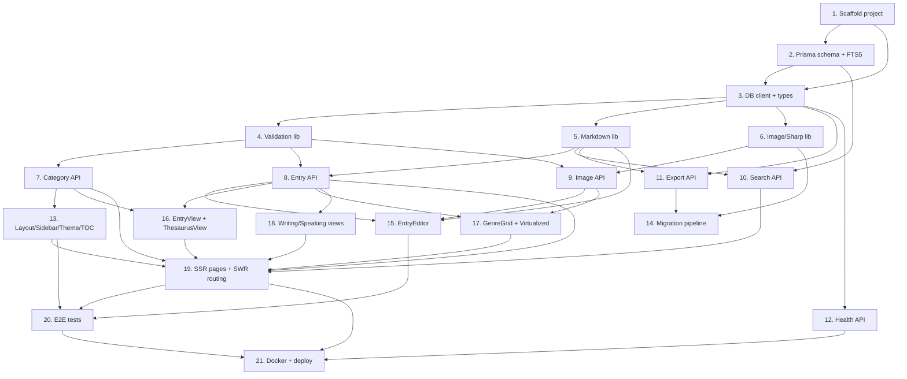

# Implementation Plan — Lexical Resources System

## Overview

This plan turns the approved design into discrete, test-backed coding tasks. Tasks are grouped into **parallel execution waves**: every task inside a wave is independent of its siblings and can be executed concurrently. A wave begins only after the prerequisite tasks it depends on (per the dependency graph) are complete.

- **Stack:** Next.js 14+ (App Router) + TypeScript + Tailwind, Prisma + SQLite (FTS5), SWR, `next-themes`, sanitized Markdown, Sharp thumbnails, virtualized large views.
- **Testing:** Vitest + fast-check (property-based) + Playwright (E2E).
- **Concurrency:** See the **Task Dependency Graph** section for the machine-readable wave definitions and the Mermaid visualization.

## Tasks

### Wave 1 — Foundation (sequential prerequisite for everything)

- [x] 1. Scaffold the Next.js + TypeScript + Tailwind project
  - Initialize a Next.js 14+ App Router project with TypeScript and the directory layout from the design (`src/app`, `src/components`, `src/lib`, `src/types`, `scripts`, `prisma`, `data`, `uploads`).
  - Install and configure Tailwind CSS with `dark:` variants and CSS variables for the category accent colors (red/purple/green/blue).
  - Add base dependencies: Prisma, SWR, `next-themes`, `react-markdown`, `rehype-sanitize`, `@tanstack/react-virtual`, `sharp`, `node-html-parser`.
  - Configure the testing toolchain: Vitest, fast-check, Playwright, with npm scripts (`test`, `test:e2e`).
  - Add a placeholder root layout and home page so the app builds and runs.
  - _Requirements: NFR 1.1, NFR 1.2_

- [x] 2. Define the Prisma data model, migrations, and FTS5 index
  - Implement the `Category`, `Entry`, `Definition`, `Example`, and `Image` models exactly as specified in the design (single mixed-language Markdown `text` fields, `viewType` + `partOfSpeech` on Category, `thumbnailFilename` on Image, cascade deletes, `@@unique([word, categoryId])`).
  - Add indexes on `parentId`, `displayOrder`, `categoryId`, and `word`.
  - Create the initial migration and an FTS5 virtual table indexing `word` + concatenated plain-text definition content, with triggers (or a rebuild step) to keep it in sync.
  - Write migration/schema validation tests against sample data.
  - _Requirements: NFR 1.2, NFR 1.3, NFR 3.3, 3.1, 6.5_

- [x] 3. Implement the Prisma client singleton and shared TypeScript types
  - Create `src/lib/db.ts` (Prisma client singleton safe for Next.js dev hot-reload).
  - Define shared types in `src/types` for Category tree, Entry, Definition, Example, Image, and the API request/response contracts from the design.
  - _Requirements: NFR 1.1, NFR 1.3_

### Wave 2 — Shared libraries (parallelizable after Wave 1)

- [x] 4. Implement input validation and sanitization utilities
  - Create `src/lib/validation.ts` with schema validation for entry, category, and image-upload payloads (required fields, types, sizes).
  - Enforce duplicate prevention rules and field-level error reporting used by the API layer.
  - Unit tests for valid/invalid payloads and edge cases.
  - _Requirements: NFR 3.1, NFR 4.1, 2.1_

- [x] 5. Implement the Markdown sanitize/render library
  - Create `src/lib/markdown.ts` and the `Markdown` component using `react-markdown` + `rehype-sanitize` allowing only the safe subset (paragraphs, line breaks, bold/italic, lists).
  - Add a plain-text extraction helper (Markdown → text) for search indexing and snippets.
  - Write property-based tests for **Property 10 (Markdown render safety)**: no script/disallowed elements survive rendering for arbitrary input.
  - _Requirements: 3.2, 3.3, NFR 4.1_
  - _Properties: Property 10_

- [x] 6. Implement image storage + Sharp thumbnail helpers
  - Create `src/lib/images.ts`: MIME sniffing + size validation (JPEG/PNG/WebP ≤ 5MB), unique filename generation, original + thumbnail (Sharp, ~320px) write to `uploads/`, and delete-both-files helper.
  - Ensure paths stay inside `uploads/` (no path traversal) and the DB file is never reachable (NFR 4.3).
  - Unit tests for validation, thumbnail generation, and deletion.
  - _Requirements: 4.1, 4.2, 4.4, NFR 4.2, NFR 4.3_

### Wave 3 — API route handlers (parallelizable after Wave 2)

- [x] 7. Implement Category API (tree, create, update, delete with reassign/cascade)
  - `GET /api/categories` (full tree), `POST` (create, incl. thesaurus groups with `viewType`/`partOfSpeech`), `PATCH` (rename/reorder/move with cycle prevention), `DELETE` (Q18: explicit `reassign` or `cascade` mode, confirmation required).
  - Use transactions for multi-record changes (NFR 3.2).
  - Property tests for **Property 2 (tree integrity / no cycles)**, **Property 8 (display order stability)**, and **Property 9 (category deletion safety)**.
  - _Requirements: 1.1, 1.2, 1.3, 1.4, 1.5, 9.1, 9.4_
  - _Properties: Property 2, Property 8, Property 9_

- [x] 8. Implement Entry API (CRUD with definitions/examples)
  - `GET /api/entries?categoryId=`, `GET /api/entries/:id`, `POST`, `PATCH`, `DELETE`.
  - Handle nested create/update of definitions and examples (Markdown `text`), duplicate detection (409), and cascade deletes.
  - Property tests for **Property 6 (duplicate prevention)** and **Property 7 (cascade integrity)**.
  - _Requirements: 2.1, 2.2, 2.3, 2.4, 3.2, 3.4, 13.2, 14.2_
  - _Properties: Property 6, Property 7_

- [x] 9. Implement Image upload/delete API
  - `POST /api/images` (multipart → validate → original + thumbnail via Task 6) and `DELETE /api/images/:id` (remove record + both files).
  - Return `Image` records with `filename` + `thumbnailFilename`; serve images through a route that does not expose the DB or arbitrary paths.
  - Integration tests for upload validation and deletion.
  - _Requirements: 4.1, 4.2, 4.3, 4.4, NFR 4.2, NFR 4.3_

- [x] 10. Implement Search API (FTS5 + LIKE fallback)
  - `GET /api/search?q=`: normalize/trim, empty-query short-circuit (no DB hit), FTS5 MATCH on word + definition text with LIKE fallback, build `SearchResult` snippets.
  - Seed-and-benchmark test asserting < 200ms for 10,000 entries.
  - Property tests for **Property 4 (search soundness)** and **Property 5 (search completeness)**.
  - _Requirements: 6.1, 6.2, 6.3, 6.4, 6.5, 11.2_
  - _Properties: Property 4, Property 5_

- [x] 11. Implement Export API (JSON / CSV / Markdown)
  - `GET /api/export?format=&categoryId=`: full-collection or single-category subtree; JSON (nested, round-trippable), CSV (flat), Markdown (by category, direct from stored Markdown).
  - Round-trip test scaffolding (full inverse test completed in Task 14 once import exists).
  - _Requirements: 8.1, 8.2, 8.3, 8.4, 8.5_
  - _Properties: Property 3_

- [x] 12. Implement Health endpoint
  - `GET /api/health` returns 200 when the DB connection is alive, non-200 otherwise.
  - Unit test for healthy/unhealthy states.
  - _Requirements: 12.5_

### Wave 4 — UI components & migration tooling (parallelizable after Wave 3)

- [x] 13. Build the layout shell: responsive sidebar, theme toggle, search bar, TOC
  - Root layout with `next-themes` provider; **default dark**, dark mode preserving the black-sidebar + colored-accent identity, light mode as a clean variant; persisted preference, no flash.
  - Recursive `Sidebar` (3+ nesting levels, active highlight, hamburger < 768px), `SearchBar` (debounced → `/search`), and `TableOfContents` (IntersectionObserver section highlighting).
  - Verify color contrast ≥ 4.5:1 in both themes; keyboard navigation and ARIA labels.
  - Component tests for sidebar tree, TOC highlighting, and theme toggle.
  - _Requirements: 5.1, 5.2, 5.3, 5.4, 5.5, 11.5, NFR 2.1, NFR 2.2, NFR 2.3, NFR 2.4_

- [x] 14. Build the migration pipeline (HTML → JSON → import)
  - `scripts/migrate-html.ts`: detect table types (thesaurus 2-col, genre 3-col+img, definition lists, look-around mixed), convert inline `<br>`/`<b>`/numbered senses to Markdown, skip empty rows, extract pronunciation, map thesaurus to nested categories; output one JSON per source page.
  - `scripts/import-json.ts`: validate + transactional bulk insert, copy images into `uploads/` with Sharp thumbnails.
  - Golden-file parser tests on known HTML samples; **Property 1 (migration round-trip)** and **Property 3 (export/import inverse)** using the Export API from Task 11.
  - _Requirements: 7.1, 7.2, 7.3, 7.4, 7.5, 4.5, 10.5_
  - _Properties: Property 1, Property 3_

- [x] 15. Build the EntryEditor (modal/drawer with Markdown + image upload)
  - Modal/drawer form for create/edit with dynamic add/remove for definitions and examples (Markdown fields + live preview via Task 5), inline image upload with thumbnail preview (Task 9), client + server validation, duplicate (409) handling.
  - Wire mutations via SWR with cache revalidation.
  - Component tests for add/remove definitions and validation display.
  - _Requirements: 2.1, 2.2, 2.4, 3.2, 3.4, 4.3_

- [x] 16. Build the read/detail views: EntryView + ThesaurusView
  - `EntryView` renders all populated fields with clear hierarchy (Markdown rendered safely).
  - `ThesaurusView` renders `viewType="thesaurus"` categories: part-of-speech → semantic-label sub-categories → word | pronunciation | definition table; entries link to their group.
  - Component tests for rendering and group linking.
  - _Requirements: 2.4, 2.5, 9.2, 9.3, 9.5, 3.3_

- [x] 17. Build GenreGridView + virtualized large-view rendering
  - `GenreGridView`: multi-column dense grid (word | meaning | thumbnail), mirroring the 3-per-row source layout using thumbnails.
  - `VirtualList` wrapper (`@tanstack/react-virtual`) so large categories/thesaurus sections render all on one scrollable page while only mounting visible rows.
  - Component test verifying virtualization mounts a bounded number of rows for a large dataset.
  - _Requirements: 10.1, 10.2, 10.3, 10.4, 11.1, 11.4_

- [x] 18. Build WritingView + SpeakingView
  - `WritingView` renders phrase/structure/expression entries (pattern text, translation, examples), preserving the phrase/structure/expression distinction.
  - `SpeakingView` formats scenes/daily dialogues conversationally.
  - Component tests for both view types.
  - _Requirements: 13.1, 13.3, 13.4, 13.5, 14.1, 14.3, 14.4_

### Wave 5 — Integration, deployment, and end-to-end verification

- [x] 19. Wire category/entry pages with SSR + SWR client routing
  - Implement `app/category/[id]`, `app/entry/[id]`, and `app/search` pages: Server Components for first paint, SWR for client interactivity, App Router client-side navigation (no full reload), client cache for recently viewed categories.
  - Pick the correct view component by `viewType`.
  - Integration tests for navigation and caching behavior; verify < 500ms localhost page load target.
  - _Requirements: 11.1, 11.4, 11.5, 5.4, 6.3_

- [x] 20. Author end-to-end tests for key flows (Playwright)
  - E2E: create entry, edit, delete, search, navigate categories, toggle theme, export each format.
  - _Requirements: 2.1, 2.2, 2.3, 6.2, 8.2, 8.3, 8.4_

- [x] 21. Containerize and finalize deployment
  - Multi-stage `Dockerfile` (deps → build → runtime), running Prisma migrations on startup.
  - `docker-compose.yml`: single service, configurable port (default 3000), named volumes for `data/` (SQLite) and `uploads/` (images + thumbnails); wire `/api/health` as the container health check.
  - Document in README the **no-auth / localhost-or-trusted-network-only** security posture (Q16) and how to add reverse-proxy protection if exposing publicly.
  - Verify a clean `docker-compose up` boots, persists data across restarts, and passes the health check.
  - _Requirements: 12.1, 12.2, 12.3, 12.4, 12.5, NFR 4.3_

## Task Dependency Graph

Tasks within the same wave have no interdependencies and can be dispatched in parallel. Each wave starts once its prerequisite tasks complete.

```json
{
  "waves": [
    {
      "wave": 1,
      "name": "Foundation",
      "parallel": false,
      "tasks": ["1", "2", "3"],
      "dependsOn": [],
      "edges": { "2": ["1"], "3": ["1", "2"] }
    },
    {
      "wave": 2,
      "name": "Shared libraries",
      "parallel": true,
      "tasks": ["4", "5", "6"],
      "dependsOn": ["3"],
      "edges": { "4": ["3"], "5": ["3"], "6": ["3"] }
    },
    {
      "wave": 3,
      "name": "API route handlers",
      "parallel": true,
      "tasks": ["7", "8", "9", "10", "11", "12"],
      "dependsOn": ["4", "5", "6"],
      "edges": {
        "7": ["4"],
        "8": ["4", "5"],
        "9": ["4", "6"],
        "10": ["2", "5"],
        "11": ["3", "5"],
        "12": ["3"]
      }
    },
    {
      "wave": 4,
      "name": "UI components & migration tooling",
      "parallel": true,
      "tasks": ["13", "14", "15", "16", "17", "18"],
      "dependsOn": ["7", "8", "9", "11"],
      "edges": {
        "13": ["7"],
        "14": ["6", "11"],
        "15": ["8", "9", "5"],
        "16": ["8", "7"],
        "17": ["8", "9"],
        "18": ["8"]
      }
    },
    {
      "wave": 5,
      "name": "Integration, deployment & E2E",
      "parallel": true,
      "tasks": ["19", "20", "21"],
      "dependsOn": ["13", "14", "15", "16", "17", "18"],
      "edges": {
        "19": ["7", "8", "10", "13", "16", "17", "18"],
        "20": ["13", "15", "19"],
        "21": ["12", "19", "20"]
      }
    }
  ],
  "criticalPath": ["1", "2", "3", "5", "8", "15", "19", "20", "21"]
}
```



## Notes

- **Parallel execution waves.** The biggest concurrency gains are in Wave 3 (6 independent API route groups) and Wave 4 (6 independent UI/tooling tasks). Dispatching each wave's tasks together — rather than strictly 1 → 21 — shortens delivery time while respecting every dependency in the graph above.

- **Wave/parallelism summary:**

  | Wave | Tasks (parallel within the wave) | Starts after |
  |------|----------------------------------|--------------|
  | 1 | 1 → 2 → 3 (sequential) | — |
  | 2 | 4, 5, 6 | Wave 1 |
  | 3 | 7, 8, 9, 10, 11, 12 | Wave 2 |
  | 4 | 13, 14, 15, 16, 17, 18 | Wave 3 |
  | 5 | 19, 20 (parallel) → 21 (last) | Wave 4 |

- **Critical path:** 1 → 2 → 3 → 5 → 8 → 15 → 19 → 20 → 21. This is the longest dependency chain and sets the minimum delivery time regardless of how much parallel capacity is available.

- **Testing is embedded per task** (unit/integration/property/E2E) rather than deferred to a single phase, so each task is independently verifiable. Property-based tests use fast-check and map to the correctness properties defined in the design.

- **Task 14 (migration)** depends on the Export API (Task 11) only for its round-trip property test; its parsing/import logic is otherwise independent of the UI, so it runs alongside the Wave 4 UI tasks.
